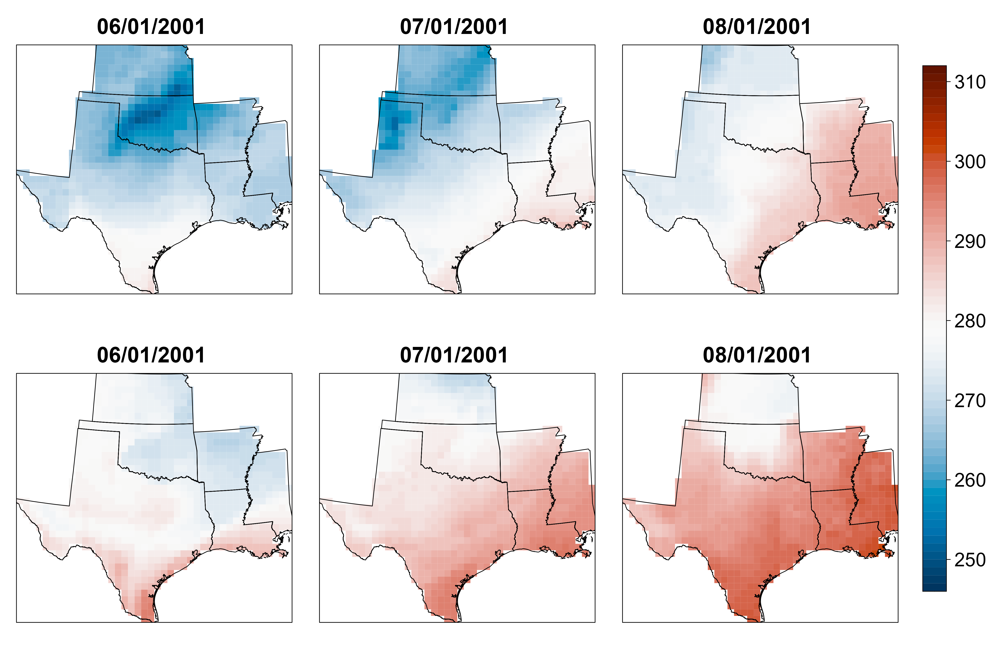
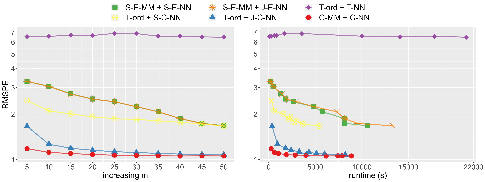

<!-- README.md is generated from README.Rmd. Please edit that file -->

# correlationVecchia

This package implements *correlation-based Vecchia approximation
(CVecchia)* and its competing methods presented in [our
paper](https://arxiv.org/abs/2112.14591), depending heavily on R
packages [GPvecchia](https://github.com/katzfuss-group/GPvecchia) and
[GpGp](https://github.com/cran/GpGp). Many supporting functions are also
included for ensuring reproducibility of the paper’s figures. Please
feel free to contact one of the authors of this package if you have any
questions.

## Installation

The latest version of correlationVecchia can be installed using:

    # install.packages("devtools")
    devtools::install_github("katzfuss-group/correlationVecchia")

## Key result

We illustrate the CVecchia on the temperature fields data from the
[North American Regional Climate Change Assessment Program
(NARCCAP)](https://www.narccap.ucar.edu/). In particular, we studied a
bivariate spatio-temporal dataset given by maximum and minimum daily
surface air temperature (tasmax and tasmin) for June–August 2001 (92
days) in the South region (Arkansas, Kansas, Louisiana, Mississippi,
Oklahoma and Texas). The figure below is Figure 10 which shows minimum
(top row) and maximum (bottom row) surface air temperature fields (in
Kelvin) in the South region from NARCCAP data.

The figure below is Figure 11 which presents comparison of predictive
performance in a log scale on test inputs in terms of root mean squared
error as functions of *m* (left) and of running time for Fisher scoring
iterations which dominates overall computing time for inference and
prediction (right). As shown in Figure 11, the CVecchia (C-MM + C-NN)
provided the lowest RMSPE for any values of hyperparameter *m*
considered. Furthermore, CVecchia offers better trade-off between
running time and prediction accuracy. The runtime analysis was performed
on a 64-bit workstation with 16 GB RAM and an Intel Core i7-8700K CPU
running at 3.70 GHz.

## Reproducing figures of the paper

Every figure in [our paper](https://arxiv.org/abs/2112.14591) can be
directly reproduced using R scripts located
[here](https://github.com/katzfuss-group/correlationVecchia/tree/master/R/output).
Before reproducing Figures 10 and 11 and Table 1, please download the
NARCCAP data
(<https://www.earthsystemgrid.org/dataset/narccap.crcm.ncep.table1/file.html>)
and the shapefile
(<https://www.census.gov/geographies/mapping-files/time-series/geo/carto-boundary-file.html>).

-   Figure 1: simulation_visualization_ordering_and_conditioning.R

-   Figure 2: simulation_knownCovparms.R →
    simulation_visualization_anisononst.R

-   Figure 3: simulation_knownCovparms.R →
    simulation_visualization_multivariate.R

-   Figure 4: simulation_visualization_spacetime_scenarios.R

-   Figure 5: simulation_knownCovparms.R →
    simulation_visualization_spacetime.R

-   Figure 6: simulation_noneuc.R → simulation_visualization_noneuc.R

-   Figure 7: simulation_fisherScoring.R →
    simulation_visualization_fisher.R

-   Figure 8: simulation_prediction.R →
    simulation_visualization_prediction.R

-   Figure 9: simulation_bayesianPosterior.R →
    simulation_visualization_noise.R

-   Figures 10 and 11 and Table 1: realdata_processing.R →
    realdata_estimation.R → realdata_performance.R →
    realdata_visualization.R

## Reference

Kang, M., & Katzfuss, M. (2021). Correlation-based sparse inverse
Cholesky factorization for fast Gaussian-process inference.
[*arXiv:2112.14591v1*](https://arxiv.org/abs/2112.14591).
